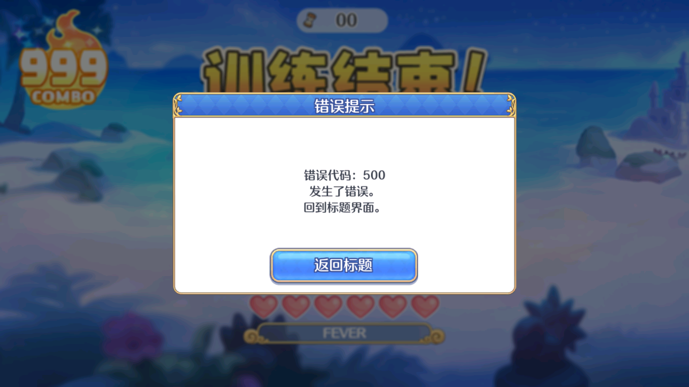

# 香织的灵魂空手道场--毒蛇清理大师
## 项目环境
- 编译器：MSVC
- 编译环境：64位
- 依赖库：opengl
因为使用到了resource.rc 所以其他的编译器是无法编译的，依赖库其实去掉也行（你需要微调代码），涉及到opengl的代码最终也没有用到。
## 项目结构
- bin: 项目的可执行文件
- resource：用到的资源文件
- dependency：依赖库
- assets：本markdown文件的资源文件
## 使用说明
只支持使用雷电模拟器运行的游戏，其他模拟器也不是不行，但你需要更改寻找子窗口的规则，以及一些其他可能不通用的配置。
打开游戏开始界面，然后运行本程序就会自动开始清理毒蛇；游戏结束并不会自行关掉，所以要记得手动关闭。

因为高度依赖你本地的环境，所以一些参数可能需要你自行去调整，或者参考我的配置：
- 屏幕分辨率：1920*1080
- 雷电模拟器分辨率设置：平板版 1600*900

代码内提取了一些参数出来可以直接尝试修改，另外还提供了debug模式以供调试。

## 常见问题

1. 不能稳定自动打蛇，会出现打错以后，一步错步步错的问题。 因为程序也是有一定成功率的，蛇清理速度快了之后，失败率也会增加，可以适当调整速度以寻求一定的平衡。
2. 为什么我没有连击到999？因为游戏有一定运气成分，连击到999需要带黄圈的蛇多出几条以打连击才能突破999，可以多尝试几次。
3. 999之后游戏崩溃。游戏开发人员也没想到你用科技整狠活，999之后他就无法处理了，打蛇也适度就行了。

## 使用效果

